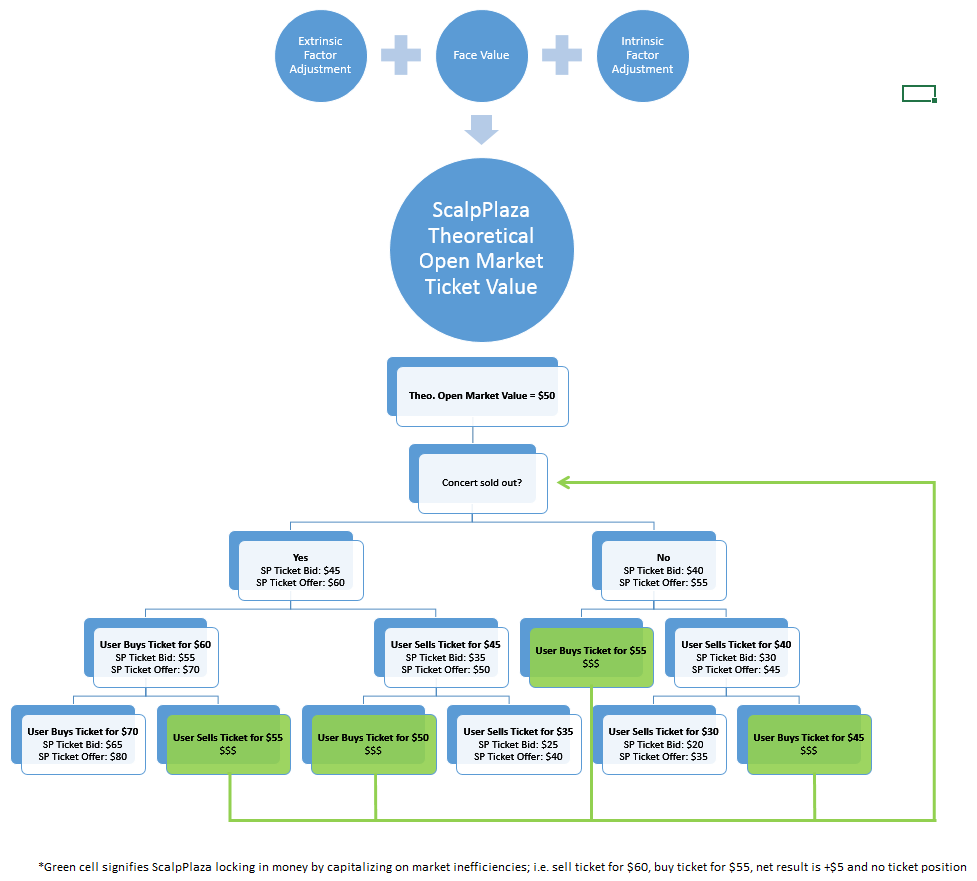

# ScalpPlaza: A More Efficient Secondary Ticket Marketplace {#ScalpPLaza}

#### Keywords

tickets, exchange, sports, concerts, theatre, entertainment, machine learning, clustering, optimization, market analysis, fun, fun, fun

## Selling the incumbent options

While the last decade has seen financial marketplaces turned upside-down by previously foreign concepts such as high-speed trading algorithms, dark pools, and "Flash Boys," the secondary ticket marketplace has remained remarkably stagnant. As a result of this lack of innovation in the industry, those looking to sell last-minute tickets to live entertainment events continue to have three imperfect options to do so:

1.	Journey over to the event venue and try to sell them the old fashioned way. This involves either trying to be louder and more aggressive than the traditionally brash and slimy crew of ticket-scalpers already stationed there, or getting lowballed and selling the tickets directly to the same people. Regardless, this is a generally undesirable option and easily the most time- and energy-intensive of the three.
2.	List the tickets in the “for sale” section of a classified advertisement website such as Craigslist. These websites, while free to use, are antiquated, largely unregulated, and thus rife with scam artists. Additionally, there is no guarantee a transaction partner will be found.
3.	List the tickets on an online ticket exchange such as StubHub or SeatGeek. While relatively painless to use, these sites are known for charging exorbitant fees (StubHub, for example, pockets 20% of every transaction) and significantly cut into sale margins. Again, there is no guarantee a buyer will be found. 


## It’s simple: buy low, sell high

ScalpPlaza’s goal is to provide users with an efficient, two-sided marketplace for any and all live entertainment events. While most incumbent online ticket exchanges only display the prices at which tickets are offered, ScalpPlaza will display both bids and offers. This will allow users to buy or sell tickets in seconds when they’re in a rush or to try “cutting the market” in hopes of getting a better deal when they can afford to be patient. 

ScalpPlaza’s primary differentiating factor, however, is its ability and willingness to act as a middleman by transacting with its users and accumulating ticket positions when the market is illiquid. This will be made possible through the use of a data-driven algorithmic ticket-pricing model. Essentially, ScalpPlaza aims to utilize historical data, market trends, and machine-learning in order to best predict what a ticket is worth on the open market based on the event’s original ticket price and a multitude of other pertinent intrinsic (performer(s), location, venue, date, social media #buzz, etc) and extrinsic (expected weather, other happenings in the area, etc) factors. The model will eventually pair this estimated ticket value with a confidence interval to generate both bid and offer prices for any given ticket. These prices will then drift dynamically based on informational changes, order flow, and ScalpPlaza’s internal ticket inventory. While the model's confidence intervals will inevitably be relatively large on Day 1, more data will lead to lower estimated ticket value variances and smaller intervals down the line. 

For example, say a certain 2018 Lady Gaga concert ticket has an estimated market value of $50. ScalpPlaza's initial bid and offer prices may be $30 and $70, respectively. By 2019, all else remaining equal, ScalpPlaza may be willing to buy that same Lady Gaga ticket (for a 2019 show, holding all other variables constant) for $40 and sell it for $60 due to increased certainty in the model's underlying $50 ticket valuation.


test3

```{r SPFlowChart,echo=FALSE,fig.cap='SPFlowChart',fig.align='center', out.width=1500, fig.asp = 1}

```


## Let the machine go to work

ScalpPlaza’s ultimate goal is to end the age-old “maximize profit or save energy” debate had by those in the secondhand ticket marketplace by providing them with a tight, two-sided ticket exchange platform. ScalpPlaza's largest challenge will likely be trying to carve out its own niche in what is already a oversaturated secondhand ticket marketplace, led be the eBay-owned behemoth StubHub. The concept of “shorting” tickets is another potential issue which will have to be investigated, both legally and logistically, before launching. Trying to wedge ScalpPlaza’s foot in the door will be an arduous process but if it can succeed in attracting even a small base of regular users, a steep growth curve should ensue as its machine-learning algorithm goes to work. The more ticket transactions that go through ScalpPlaza, the more data it acquires, the smarter its algorithm becomes, and the tighter ticket markets its willing to offer become.  The tighter the markets, the more likely customers are to return for their next secondary ticket transaction. Increased customer traffic leads to even more troves of data being fed into ScalpPlaza's machine-learning algorithm, and the cycle starts over. While data represent the grease that makes the ScalpPlaza wheels turn, the end result is a sustainable marketplace which can leverage its multiple revenue streams in order to charge its customers significantly lower fees than its competitors.
